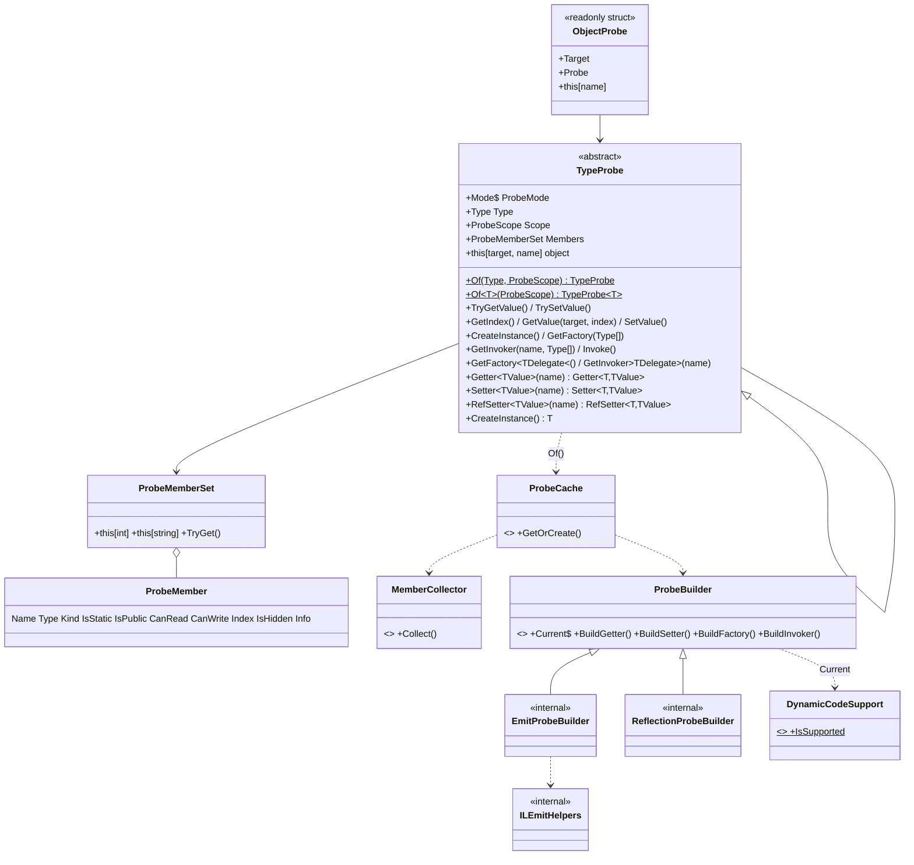

# ReflectProbe 설계

> FastMember 1.5.0 분석에서 가져갈 점(타입 단위 1회 생성 · 이름 → 인덱스 → IL switch · 판단은 생성 시점)은 유지하고,
> 고칠 점(캐시 경쟁 조건 · 모호한 접근 범위 · private 필드 미지원 · 박싱 · 래퍼 할당)은 바꾼 Reflection 대체 라이브러리.

## 1. 설계 결정 기록

| # | 항목 | 결정 | 이유 |
|---|---|---|---|
| 1 | 이름 | 패키지·네임스페이스 `ReflectProbe`, 클래스는 Probe 계열 | FastMember 의 Accessor 이름과 구분 |
| 2 | 타깃 | `netstandard2.1;net8.0` | Unity(Mono) 참조 가능 + 최신 런타임 |
| 3 | 디스패치 | 타입당 DynamicMethod 1개 + IL `switch` | FastMember 방식 계승. 해시 1번 + 점프 1번 |
| 4 | struct 대상 쓰기 | 강타입 API 에 `RefSetter<T,TValue>` 제공 | object 로 받으면 박스 사본에 써져 원본이 안 바뀜 |
| 5 | 예외 | `ProbeException` 계층 (`MemberNotFound` / `MemberNotReadable` / `MemberNotWritable`) | FastMember 는 전부 `ArgumentOutOfRangeException("name")` |
| 6 | Invoker 오버로드 | 이름 + 매개변수 타입. 이름만 주면 오버로드 1개일 때만 | 모호성 제거 |
| 7 | ObjectProbe | `readonly struct` | 래퍼 생성 할당 0 |
| 8 | 진입점 / 범위 | `TypeProbe.Of<T>(ProbeScope)` | |
| 9 | 기본 범위 | `ProbeScope.All` (Public · NonPublic · Instance · Static) | private 접근이 이 라이브러리의 차별점 |
| 10 | 백킹 필드 | `[CompilerGenerated]` 필드 제외 | 값은 프로퍼티 이름으로 접근 |
| 11 | 부모 private 필드 | BaseType 체인까지 수집, 이름 충돌 시 자식 우선 (가려진 멤버는 `IsHidden`, 인덱스로만 접근) | `GetFields(NonPublic)` 는 부모 private 을 돌려주지 않음 |
| 12 | readonly 필드 쓰기 | 인스턴스 readonly 허용, static readonly 불가 | static readonly 는 JIT 가 상수처럼 다룰 수 있음 (공식 문서 확인 필요) |
| 13 | AOT | Reflection 폴백 (아래 4장) | IL2CPP · NativeAOT 에서도 동작은 하게 |
| 14 | 캐시 | `ConcurrentDictionary<(Type, ProbeScope), Lazy<TypeProbe>>`, `ExecutionAndPublication` | 동시 최초 생성에도 IL 생성 1회 |
| 15 | 생성 경로 | DynamicMethod 만 사용, TypeBuilder 경로 없음 | 언로드 불가 + FastMember 동적 어셈블리 초기화 경쟁의 원인 |
| 16 | const 필드 | 수집 제외 (10주) | 저장 공간이 없어 `ldsfld` 불가. 필요하면 `FieldInfo.GetRawConstantValue` |
| 17 | 잘못된 입력 | 런타임 예외 그대로 전파 (10주) | null target → `NullReferenceException`, 타입 불일치 → `InvalidCastException`. 히트 경로 검사 비용 0, FastMember 와 같음 |
| 18 | TypeProbe 생성 | 생성자가 `ProbeBuilder` 를 받음 (10주) | 4장의 "테스트에서 ReflectionProbeBuilder 직접 주입" 경로. ProbeCache 는 `ProbeBuilder.Current` 를 넘긴다 |
| 19 | override 프로퍼티 | 가장 파생된 것 1개만 수집, 빠진 접근자는 부모 선언에서 보충 (10주) | getter 만 override 하면 파생 `PropertyInfo.SetMethod` 가 null 이라 쓰기가 막히는 문제 |
| 20 | 이름 맵 위치 | `ProbeMemberSet` 이 멤버 목록의 `IsHidden` 으로 직접 생성, TypeProbe 도 이것을 사용 (10주) | 맵 이중화 방지. MemberCollector 는 목록만 반환 |
| 21 | 이름 중복 시 깊이 기반 접근 | `probe[p, "_tag", 1]` — 세 번째 인자 `depthOffset` 으로 부모 계층 지정 (11주 구현) | 숫자 인덱스(`probe[p, 5]`)는 목록 순번이 바뀌면 깨지므로, 의미 있는 깊이 오프셋으로 접근하는 API 를 별도 제공한다. `0` = 자식(기본), `1` = 직속 부모, `2` = 조부모 |
| 22 | 생성자 · 메서드 매개변수 매칭 | 타입이 정확히 일치하는 것만. `Type.GetMethod` 의 기본 Binder 를 쓰지 않고 직접 비교 (12주) | 기본 Binder 는 대입 가능한 오버로드도 골라 `Describe(object)` 가 `Describe(string)` 요청에 잡힌다. 결정 6 의 "모호성 제거"와 충돌 |
| 23 | 메서드 수집 규칙 | 필드(결정 11 · 19)와 같음 : BaseType 체인 DeclaredOnly (부모 private 포함), override 는 가장 파생된 1개, 같은 시그니처 `new` 는 자식 우선. 특수 이름(접근자 · 연산자) · 제네릭 메서드 정의 · ref/out/포인터 시그니처 제외 (12주) | 필드 API 와 같은 규칙이어야 사용자가 예측 가능 |
| 24 | 기본 생성자 | `TypeProbe<T>.CreateInstance()` 는 `Func<T>` (struct 박싱 없음). struct 는 선언된 매개변수 없는 생성자 우선, 없으면 `initobj`. 추상 · 인터페이스 · static 클래스 · 생성자 없음은 `CanCreateInstance = false`, `CreateInstance()` 는 `MemberNotFoundException(".ctor()")` (12주) | Activator 는 `MissingMethodException` 이지만 라이브러리 예외 계층(결정 5)으로 통일 |
| 25 | struct 인스턴스 메서드 | 박스 대상 지원 : `unbox` 주소로 `call` → 값을 바꾸는 메서드는 박스 원본 수정 (12주, 5장 범위 밖에서 이동) | 이름 기반 setter 와 같은 규칙. `EmitLoadTarget` 재사용이라 추가 코드 없음 |
| 26 | 생성 시점 · 캐시 | 메서드 목록 · 기본 팩토리는 처음 쓸 때 `Lazy` 로 1회. 팩토리 · Invoker 는 `ConstructorInfo` · `MethodInfo` 키 캐시, `Invoke(name)` 은 이름 키 캐시 (12주) | 필드만 쓰는 타입은 메서드 수집 비용 0. 같은 메서드를 다른 경로로 찾아도 델리게이트 1개 |
| 27 | 강타입 Factory · Invoker | `GetFactory<TDelegate>()` · `GetInvoker<TDelegate>(name)` — 델리게이트 타입이 시그니처를 정한다. 매개변수 · 반환 타입 정확 일치 (오버로드는 매개변수로 결정), 인스턴스 메서드는 첫 매개변수가 대상 : class 는 선언 · 파생 타입 또는 부모 · object (castclass), struct 는 `ref T`(원본) 또는 `T`(사본). static 과 인스턴스가 모두 맞으면 `AmbiguousMemberException` (12주) | object[] 기반 `ProbeFactory` · `ProbeInvoker` 는 인자 배열 · 박싱 · 반환 박싱이 남는다 (메서드 80 B = MethodInfo.Invoke). 11주 Getter&lt;TValue&gt; 와 같은 이유로 강타입 경로를 둔다. 아리티별 오버로드(`GetInvoker<T1, TResult>` …)는 void · 인자 수마다 메서드가 늘어나 택하지 않음 |

| 28 | 폴백 감지 | `RuntimeFeature.IsDynamicCodeSupported` 가 false 면 폴백, true 여도 작은 DynamicMethod 를 1회 생성 · 호출해 보고 **어떤 예외든** 나면 폴백. 두 TFM 같은 코드 (13주) | netstandard2.1 표면에도 이 API 가 있다 (`NETStandard.Library.Ref 2.1.0` 확인). 다만 Unity IL2CPP 등이 값을 정확히 돌려주는지 확실하지 않아 시험 생성을 겹친다. 예외가 새면 정적 초기화 실패로 라이브러리 전체가 막히므로 예외 타입을 좁히지 않는다 |
| 29 | 폴백 테스트 방식 | 테스트 프로젝트 2개 : `ReflectProbe.Tests.Reflection` 이 같은 .cs 를 링크하고 모듈 초기화에서 internal `ProbeBuilder.ForceCurrent(new ReflectionProbeBuilder())`. 공개 스위치 없음 (13주) | 캐시(`Of`) 경로까지 그대로 폴백으로 검증. 테스트 어셈블리마다 프로세스가 달라 Emit 테스트와 섞이지 않는다. 4장 초안(테스트마다 빌더 직접 주입)은 테스트 152개 수정 + 캐시 경로 미검증이라 택하지 않음 |
| 30 | 폴백 동작 동등성 | Reflection 빌더가 IL 의 castclass / unbox.any / ldelem 과 같은 예외를 낸다 (null 대상 · 값 타입에 null → `NullReferenceException`, 타입 불일치 → `InvalidCastException`, 인자 부족 → `IndexOutOfRangeException`). 호출 예외는 `TargetInvocationException` 을 벗겨 원래 예외로 (13주) | Reflection API 그대로면 `TargetException` · `ArgumentException` 을 내거나 null 을 default 로 바꿔 결정 17 과 달라진다. 같은 테스트 세트가 두 모드에서 통과하는 것이 기준 |
| 31 | 폴백 강타입 Factory · Invoker | 식 트리를 `Compile(preferInterpretation: true)` 로 만든다 : 인자 → object[] → object 기반 팩토리 · Invoker → 반환 변환. ref 매개변수 델리게이트는 만들지 않는다 (결정 34) (13주) | 델리게이트 타입이 사용자 지정이라 C# 람다로 만들 수 없다. 인터프리터는 IL 을 생성하지 않는다. Getter / Setter / RefSetter 는 델리게이트 타입이 고정이라 C# 람다 |
| 32 | 강타입 델리게이트 캐시 게시 | Getter / Setter / RefSetter 도 `GetOrAdd` 반환값을 돌려준다 (13주 버그 수정) | 11주 구현은 `TryAdd` 후 지역 변수를 반환해, 동시 최초 호출 32개 중 최대 31개가 서로 다른 인스턴스를 받았다 (`ConcurrencyTests` 로 3/3 재현). 생성자 · Invoker 캐시(결정 26)와 같은 규칙 : 2번 만들어질 수는 있어도 게시는 1개 |
| 33 | netstandard2.1 결과물 검증 | 테스트 프로젝트가 `-p:ProbeLibraryTfm=netstandard2.1` 이면 `SetTargetFramework` 로 그 결과물을 참조. `tests/run-matrix.ps1` 이 net8.0 · netstandard2.1 × Emit · Reflection 4회 실행 (13주) | .NET 10 런타임 위에서 netstandard2.1 DLL 을 그대로 검증. 어느 DLL 을 썼는지는 `TargetFrameworkAttribute` 테스트로 확인 |

| 34 | 폴백의 ref 매개변수 델리게이트 | Reflection 모드에서 `GetFactory<TDelegate>` · `GetInvoker<TDelegate>` 의 델리게이트에 ref 매개변수가 있으면 런타임과 관계없이 `NotSupportedException` (대안 : 대상을 T 로 받는 사본 호출, 또는 박스 원본을 수정하는 object 기반 `GetInvoker(name, types)`) (13주) | Unity IL2CPP(WebGL) 실측 : 식 트리 인터프리터가 `NotImplementedException: byref delegate`. CoreCLR 인터프리터는 되므로 그대로 두면 런타임마다 동작이 갈린다. 제네릭 어댑터로 지원하는 안은 인자 개수 × void/반환 조합마다 클래스가 늘어 택하지 않음 |
| 35 | 강타입 Getter / Setter / RefSetter 의 TValue | 멤버 타입과 정확히 일치하거나 참조 변환 · 박싱/언박싱(object · 부모 타입 · 인터페이스)만 허용. 서로 다른 값 타입(int ↔ float, enum ↔ int, `int?` ↔ int 포함)은 델리게이트를 만들 때 `InvalidCastException`. 값 타입을 박싱해도 들어갈 수 없는 참조 타입(int → string 등)도 같다. struct 인스턴스 멤버의 `Setter` 는 `NotSupportedException` (static 멤버는 허용). 두 모드 공용 검사 (14주 버그 수정) | 수정 전 Emit 은 변환 IL 없이 비트를 재해석해 예외 없이 틀린 값을 냈다 (int -7 → `Getter<float>` = NaN, `Setter<float>` 5f → 1084227584). struct `Setter` 는 Emit 에서 NullReferenceException, 폴백에서는 조용히 무시. 폴백의 호출 시 `InvalidCastException` 과도 달랐다 (결정 30). 처음 수정은 값 타입 ↔ 값 타입만 막아 `Getter<string>(int 멤버)` 가 int 상자를 string 으로 돌려주는 타입 혼동이 남아 있었고, 14주 점검에서 함께 막았다. 만들 때 막으므로 호출 비용은 0 |
| 36 | 함수 포인터 멤버 | 포인터와 같이 수집하지 않는다 (멤버 · 메서드 시그니처 · 대상 타입). `BaseType` 이 없고 object · 인터페이스가 아닌 타입으로 판단 (14주 점검) | 박싱할 수 없는 타입. 수정 전 Emit 은 함수 포인터 값을 object 참조로 돌려줘 사용하는 순간 프로세스가 종료됐다. `Type.IsFunctionPointer` 는 .NET 8 부터라 netstandard2.1 과 같은 코드를 쓴다 |
| 37 | Nullable 멤버 쓰기 | 정확히 같은 V 의 상자 또는 null 만. `DayOfWeek?` 에 int 상자는 두 모드 모두 `InvalidCastException` (14주 점검, 결정 30 보완) | Emit 의 `unbox.any Nullable<V>` 규칙. 수정 전 폴백은 열거형 ↔ 정수를 허용해 두 모드가 달랐다 |
| 38 | 인터페이스 대상의 상속 멤버 | 상속한 인터페이스의 프로퍼티 · 메서드를 모두 수집. 깊이(`DepthOffset`)는 가장 긴 상속 경로. 더 파생된 인터페이스의 같은 이름(메서드는 같은 시그니처)이 부모를 가리고, 상속 관계가 없는 부모끼리 겹치면 이름 접근은 `AmbiguousMemberException` (`Try*` 는 false), 인덱스 접근은 가능 (14주, 사용자 확인) | `Type.GetProperties` 는 인터페이스의 부모 멤버를 돌려주지 않아 `TypeProbe.Of<IList<int>>()` 에서 `Count` 를 찾지 못했다. FastMember 는 지원하지만 먼저 나온 쪽을 고르고 `GetInterfaces()` 의 순서는 보장되지 않는다. C# 도 모호성 오류다. 상속 판단은 제네릭 변성 때문에 `IsAssignableFrom` 을 쓰지 않는다 |
| 39 | 박싱할 수 없는 매개변수의 생성자 | object 기반 `GetFactory(types)` 는 찾을 때 `MemberNotFoundException` (메서드 규칙과 같음). 강타입 `GetFactory<TDelegate>` 는 Emit 에서 지원, 폴백에서 `NotSupportedException` (14주, 사용자 확인) | 수정 전 Emit 은 만들어진 뒤 호출할 때, 폴백의 강타입은 만들 때 `InvalidProgramException` |
| 40 | `Nullable<V>` 대상 | `ArgumentException` (14주, 사용자 확인) | `int?` 를 박싱하면 int 상자라 대상 객체로 존재하지 않는다. 수정 전 Emit 은 쓰기가 조용히 사라지고 폴백은 `FieldAccessException` |
| 41 | 인터페이스의 static abstract · static virtual | 수집하지 않는다 (14주 점검) | constrained 호출이 아니면 부를 수 없다. 수정 전 Emit 은 이 멤버 하나 때문에 타입 전체 접근이 `BadImageFormatException` (IL switch 가 메서드 1개) |

### 계획서 초안에서 바뀐 점

- 초안의 `EmitTypeProbe` / `ReflectionTypeProbe` (TypeProbe 파생 클래스) → **`ProbeBuilder` 전략 2개** (`EmitProbeBuilder`, `ReflectionProbeBuilder`).
  - TypeProbe 는 빌더가 만든 델리게이트만 보관한다. 히트 경로가 `TryGetValue(name)` → 델리게이트 호출 1번으로 끝나고 가상 호출 단계가 없다.
  - 모든 TypeProbe 인스턴스가 `TypeProbe<T>` 여야 `Of(typeof(T))` 와 `Of<T>()` 가 같은 객체를 돌려줄 수 있는데, 구현을 파생 클래스로 나누면 이 조건과 충돌한다.
- `AmbiguousMemberException` 추가 (결정 6 의 "오버로드 2개 이상" 경우).

## 2. 클래스 구조


```mermaid
classDiagram
    class TypeProbe {
        <<abstract>>
        +Of(Type, ProbeScope)$ TypeProbe
        +Of~T~(ProbeScope)$ TypeProbe~T~
        +Mode$ ProbeMode
        +Type Type
        +ProbeScope Scope
        +ProbeMemberSet Members
        +this[target, name] object
        +TryGetValue() / TrySetValue()
        +GetIndex() / GetValue(target, index) / SetValue()
        +CreateInstance() / GetFactory(Type[])
        +GetInvoker(name, Type[]) / Invoke()
        +GetFactory~TDelegate~() / GetInvoker~TDelegate~(name)
    }
    class TypeProbe~T~ {
        +Getter~TValue~(name) Getter~T,TValue~
        +Setter~TValue~(name) Setter~T,TValue~
        +RefSetter~TValue~(name) RefSetter~T,TValue~
        +CreateInstance() T
    }
    class ObjectProbe {
        <<readonly struct>>
        +Target
        +Probe
        +this[name]
    }
    class ProbeMemberSet { +this[int] +this[string] +TryGet() }
    class ProbeMember { Name Type Kind IsStatic IsPublic CanRead CanWrite Index IsHidden Info }
    class ProbeCache { <<internal>> +GetOrCreate() }
    class MemberCollector { <<internal>> +Collect() }
    class ProbeBuilder { <<internal abstract>> +Current$ +BuildGetter() +BuildSetter() +BuildFactory() +BuildInvoker() }
    class EmitProbeBuilder { <<internal>> }
    class ReflectionProbeBuilder { <<internal>> }
    class DynamicCodeSupport { <<internal>> +IsSupported$ }
    class ILEmitHelpers { <<internal>> }

    TypeProbe <|-- TypeProbe~T~
    ObjectProbe --> TypeProbe
    TypeProbe --> ProbeMemberSet
    ProbeMemberSet o-- ProbeMember
    TypeProbe ..> ProbeCache : Of()
    ProbeCache ..> MemberCollector
    ProbeCache ..> ProbeBuilder
    ProbeBuilder <|-- EmitProbeBuilder
    ProbeBuilder <|-- ReflectionProbeBuilder
    ProbeBuilder ..> DynamicCodeSupport : Current
    EmitProbeBuilder ..> ILEmitHelpers
```

| 파일 | 공개 | 역할 |
|---|---|---|
| `TypeProbe.cs` | public | 타입 단위 진입점, 이름·인덱스 접근, 생성자, 메서드 |
| `TypeProbe.Generic.cs` | public | 강타입 Getter / Setter / RefSetter |
| `ObjectProbe.cs` | public | 객체 1개 래퍼 (struct) |
| `ProbeMember.cs`, `ProbeMemberSet.cs` | public | 메타데이터 |
| `ProbeScope.cs`, `ProbeMode.cs` | public | 범위 플래그, 생성 방식 |
| `ProbeDelegates.cs` | public | Getter, Setter, RefSetter, ProbeFactory, ProbeInvoker |
| `ProbeExceptions.cs` | public | 예외 계층 |
| `Internal/ProbeCache.cs` | internal | 동시성 캐시 |
| `Internal/MemberCollector.cs` | internal | 멤버 수집 + 이름 맵 (단일 목록에서 생성) |
| `Internal/ProbeBuilder.cs` 외 2개 | internal | Emit / Reflection 델리게이트 생성 |
| `Internal/DynamicCodeSupport.cs` | internal | 폴백 감지 |
| `Internal/ILEmitHelpers.cs` | internal | castclass / unbox / box 변환 |

## 3. 핵심 흐름

```text
TypeProbe.Of<Player>()
  └ ProbeCache.GetOrCreate(typeof(Player), All)
      ├ 히트 : Lazy.Value 반환 (락 없음)
      └ 미스 : Lazy 1개만 실행
          ├ MemberCollector.Collect → ProbeMember[] (→ ProbeMemberSet 이 name→index 생성)
          ├ ProbeBuilder.Current.BuildGetter / BuildSetter (IL switch DynamicMethod)
          └ new TypeProbe<Player>(...)

probe[p, "hp"]
  └ name→index TryGetValue → _getter(index, p) → switch(index) → ldfld hp → box
probe.GetValue(p, index)        ← 해시 생략
probe.Getter<int>("hp")(p)      ← 멤버 전용 DynamicMethod, 박싱 없음
```

## 4. AOT 폴백

- 감지 : 프로세스당 1회 (결정 28). `RuntimeFeature.IsDynamicCodeSupported` + DynamicMethod 시험 생성 · 호출, 두 TFM 같은 코드.
- 동작 : 공개 API 동일 (결정 30, 예외 : ref · 포인터 · ref struct 매개변수 델리게이트는 결정 34 · 39). 내부는 멤버마다 MemberInfo 를 붙잡은 델리게이트 배열로 GetValue / SetValue / Invoke. 강타입 API 도 박싱이 남고, 강타입 Factory · Invoker 는 식 트리 인터프리터를 거친다 (결정 31).
- 확인 : `TypeProbe.Mode`. 테스트는 두 번째 테스트 프로젝트가 모듈 초기화에서 internal `ProbeBuilder.ForceCurrent` 로 폴백을 고정해 같은 테스트를 실행 (결정 29). 할당 0 B 테스트 3개는 `[EmitOnlyFact]` 로 폴백에서 건너뛴다.
- Unity 실측 (13주, `05_코드/ReflectProbeUnityCheck/Results/README.md`)
  - Mono 에디터 (6000.0.61f1 · 2022.3.20f1) : 감지 Emit, 16/16. 폴백 강제도 16/16.
  - IL2CPP (WebGL, 6000.0.61f1) : `RuntimeFeature.IsDynamicCodeSupported = False` → Reflection 으로 자동 전환. `Of(Type)` 으로 제네릭에 안 쓴 struct 도 동작 (MakeGenericType).
  - Managed Stripping High 에서는 이름으로만 쓰는 사용자 멤버(private setter · private 메서드)가 제거된다 → **`link.xml` 또는 `[Preserve]` 필요** (실측 재현 · 해결 확인). 기본값(Minimal)에서는 제거되지 않았다.
  - ref 매개변수 델리게이트는 결정 34.

## 5. 범위 밖

ObjectReader(IDataReader), DLR `dynamic`, TypeBuilder 경로, ref/out 매개변수, 제네릭 메서드 정의, 이름으로 연산자 · 프로퍼티 접근자 호출.

## 6. 구현 전 확인할 세부 항목

| 항목 | 현재 안 |
|---|---|
| `Getter<TValue>` 의 TValue 가 멤버 타입과 다를 때 | 14주 확정 : 결정 35 |
| struct 대상에 `Setter<TValue>` 호출 | 14주 구현 : `NotSupportedException` (결정 35, static 멤버 제외) |
| static 멤버의 강타입 Getter | target 인자를 무시 |
| 인스턴스 readonly 필드에 DynamicMethod `stfld` | 10주 확인 : 동작함 (`Indexer_InstanceReadonlyField_Writes`) |
| 박싱된 struct 를 `unbox` 주소로 쓰기 | 10주 확인 : 박스 원본이 바뀜 (`BoxedStruct_*`) |

## 7. 11주 구현 계획

### 7-1. 깊이 기반 이름 접근 (depthOffset 오버로드)

**배경**: 이름이 같은 필드가 부모-자식 계층에 모두 존재할 때, 현재는 자식이 이름 맵에 들어가고 부모는 `IsHidden=true` 로 인덱스로만 접근할 수 있다. 인덱스는 목록 순번에 의존하므로 계층이 바뀌면 깨진다.

**API (예정)**

```csharp
// 현재 (자식 필드 — depthOffset=0 과 동일)
probe[p, "_tag"]

// 11주 추가
probe[p, "_tag", 1]   // 직속 부모(Animal)의 _tag
probe[p, "_tag", 2]   // 조부모의 _tag
```

**구현 포인트**

1. `MemberCollector.Collect` 가 부모 깊이 정보를 `ProbeMember.DepthOffset` 프로퍼티로 기록한다.
   - `BaseType` 체인을 내려가면서 `DeclaredOnly`로 수집. `DepthOffset = 0`(자식), `1`(직속 부모), `2`(조부모) …
2. `ProbeMemberSet` 에 `TryGet(string name, int depthOffset, out ProbeMember)` 오버로드 추가.
   - `depthOffset == 0` 이면 기존 `_nameToIndex` 맵 사용.
   - `depthOffset >= 1` 이면 `IsHidden == true` 인 멤버 중 `Name == name && DepthOffset == depthOffset` 을 찾는다. 히트 경로가 아니므로 선형 탐색 허용.
   - **구현 시 변경 (11주)**: `IsHidden` 조건은 빼고 `Name == name && DepthOffset == depthOffset` 만 본다. 자식에 없는 부모 멤버(`Dog` 의 `_age`)는 가려지지 않아서, `IsHidden` 만 찾으면 `probe[dog, "_age", 1]` 이 실패하기 때문. 음수는 `ArgumentOutOfRangeException`, 없으면 `MemberNotFoundException`.
3. `TypeProbe` 에 인덱서 오버로드 추가.
   ```csharp
   public object? this[object? target, string name, int depthOffset]
   {
       get => _getter(GetIndex(name, depthOffset), target);
       set => _setter(GetIndex(name, depthOffset), target, value);
   }
   ```
4. `GetIndex(string name, int depthOffset)` 헬퍼를 `TypeProbe` 에 추가. `depthOffset == 0` 이면 기존 경로, 아니면 `Members.TryGet(name, depthOffset, ...)`.

**비고**: IL switch 의 인덱스 번호는 그대로 사용하므로 getter/setter DynamicMethod 변경 없음. 맵 탐색 레이어만 추가된다.

### 7-2. RefSetter (박싱 없는 struct 쓰기)

**배경**: 현재 setter 경로는 `object` 로 받아 박스된 인스턴스에 `unbox` + `stfld` 한다. 박싱되지 않은 로컬 struct 는 사본만 바뀐다.

**API (예정)**

```csharp
// 강타입 API — TypeProbe<T>
RefSetter<Dog, string> refSetTag = probe.RefSetter<string>("_tag");
refSetTag(ref dog, "bark");  // 박싱 없이 원본에 직접 씀
```

**구현 포인트**

- `RefSetter<T, TValue>` 델리게이트: `delegate void RefSetter<T, TValue>(ref T target, TValue value)` (이미 `ProbeDelegates.cs` 에 선언 예정)
- `EmitProbeBuilder.BuildRefSetter` : `unbox T` 로 주소를 꺼내고 `stfld` 로 씀. 대상이 참조 타입이면 `castclass` 후 `stfld`.
- `TypeProbe<T>.RefSetter<TValue>(string name)` 공개 API.

**비고**: getter 쪽 `unbox.any` 복사 비용은 `Getter<TValue>` 에서는 그대로 남는다. object API 를 쓰지 않는 경우에만 박싱 비용이 제거된다.
